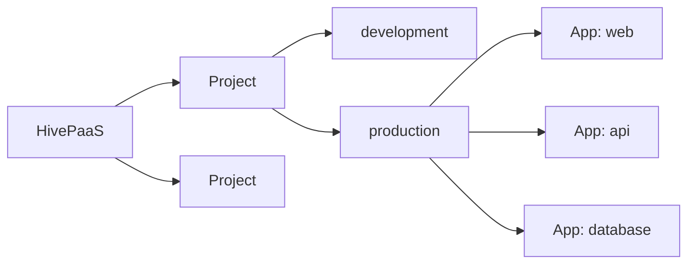

# Core concepts

## Projects

A **project** groups the apps that belong together, such as a product, a
client, or a team's services. Access is given per project: a user sees the
projects they are given, and nothing else.

## Environments

A project has one or more **environments**, up to ten: `development` and
`production` by default, and any others you add, such as `staging`.

Each environment is apart from the others:

- **its own apps**: the `production` and `development` copies of an app are two
  apps, each with its own settings and data;
- **its own private network**: its apps reach one another, and not the apps of
  another environment;
- **its own settings**, on top of the project's.

## Apps

An **app** is one service you run, in one environment of a project: a website,
an API, a worker, a database. Each app is a Docker Swarm service, with one or
more containers.

An app has:

- **a kind**: a web app, a database, a cache, or storage;
- **a source**: a Docker image, or a Git repository HivePaaS builds an image from;
- **its settings**: env vars and secrets, domains and routing, storage,
  resources, health checks, jobs.

The apps of an environment reach one another by their **key**, made from the
app's name: an app named `My API` has the key `my-api`, and the other apps of
its environment reach it at `http://my-api:8080`, on the port it listens on.
Each app also finds its own key in its env var `HIVEPAAS_HOST`.

### Deployments

A **deployment** puts an app's settings and source into effect: it builds the
image when the source is a repository, then updates the app's service. Each
deployment is kept, with its logs and status.

An app from the app store is deployed as it is created, with the apps it
needs, such as its database, first.

## Settings and their scopes

Credentials, registries, storages, certificates, notifications and other
settings are made at one of four scopes:

| Scope           | Where                                        | Used by                                                                     |
| --------------- | -------------------------------------------- | --------------------------------------------------------------------------- |
| **Global**      | Settings, and Integrations, in the main menu | projects, when marked **Available in Projects**                             |
| **Project**     | the project's Settings and Integrations      | the project's apps, in every environment, when marked **Available in Apps** |
| **Environment** | the project's pages, for one environment     | the environment's apps                                                      |
| **App**         | the app's configuration                      | the app                                                                     |

A setting made once, globally, can serve every project: a registry's
credentials, a cloud storage for backups, an email account for notifications.

Env vars follow scopes as well: an app gets the env vars of its project and
environment, and its own ones win over theirs.

## Domains

HivePaaS answers on two kinds of domain:

- **the app domain**, the dashboard's, such as `hivepaas.example.com`;
- **the root domain**, such as `example.com`: apps get domains under it, such as
  `shop.example.com`.

A wildcard DNS record, `*.example.com`, sends every such domain to your server,
and HivePaaS gets each one its certificate from Let's Encrypt.

## Nodes

HivePaaS runs on a Docker Swarm. The server it is installed on is its first
**node**, a manager; more servers can join as workers, and apps can be placed on
the nodes you choose.

## Tasks and audit logs

- **Tasks** are the background work HivePaaS runs, such as a deployment, a
  backup or a cleanup, each with its status and logs.
- **Audit logs** record what was done, by whom, and when: at the level of the
  whole install, a project, and an environment.

## Users and access

- **Users** are invited by an admin, by email.
- **Access** is given per project, and per module, such as settings or the
  cluster, to read or to change.
- **API keys** let scripts act as a user, within the limits the key was made
  with.
