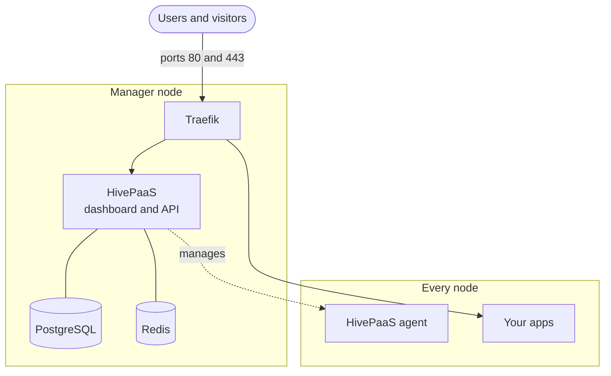

# Introduction

HivePaaS is a self-hosted platform for running your apps on your own servers.
You give it an image, a Git repository or a template from its app store, and it
builds, deploys, routes and secures the app: the way Heroku or Render work, on
servers you own.

It runs on [Docker Swarm](https://docs.docker.com/engine/swarm/), from a single
server to a cluster of them, and is open source under the Apache 2.0 license.

## What it does

### Deploys your apps

- From a Docker image, from a Git repository it builds, or from a template of
  its app store: databases, CMSs, analytics, and more.
- Automatically on a push, through the GitHub App or a webhook.
- A preview of an app for each pull request.

### Serves them on your domains

- Routing through [Traefik](https://traefik.io), with certificates from Let's
  Encrypt issued and renewed on their own.
- Redirects, path rules, rate limits, basic auth and allowed IPs, per app.

### Keeps them running

- Health checks, resource limits, replicas, and placement on the nodes you choose.
- Backups of their data to S3-compatible storage, and restores.
- Scheduled jobs, live logs, and a terminal into their containers.
- Notifications by email, Slack, Discord and Telegram.

### Works for a team

- Projects, each with its own environments, such as `development` and `production`.
- Users with access per project and per module, two-factor authentication, and
  sign-in with your OAuth or OIDC provider.
- A REST API, and an MCP server for AI assistants.

## How it works

- **Traefik** takes every request on ports 80 and 443, and routes it to the
  dashboard or to one of your apps, by its domain.
- **The HivePaaS app** serves the dashboard and the API, runs the work behind
  them, such as builds, deployments and backups, and drives Docker Swarm: each
  of your apps is a Swarm service.
- **PostgreSQL and Redis** keep HivePaaS's own records.
- **An agent on each node** gives HivePaaS what it needs from that node.

The installer sets all of this up on your first server.

## Next

- [Quick start](./quick-start.md): from a fresh server to your first app.
- [Core concepts](./concepts.md): projects, environments, apps and settings.
- [Installation](../installation/requirements.md): what a server needs, and the
  installer in full.
